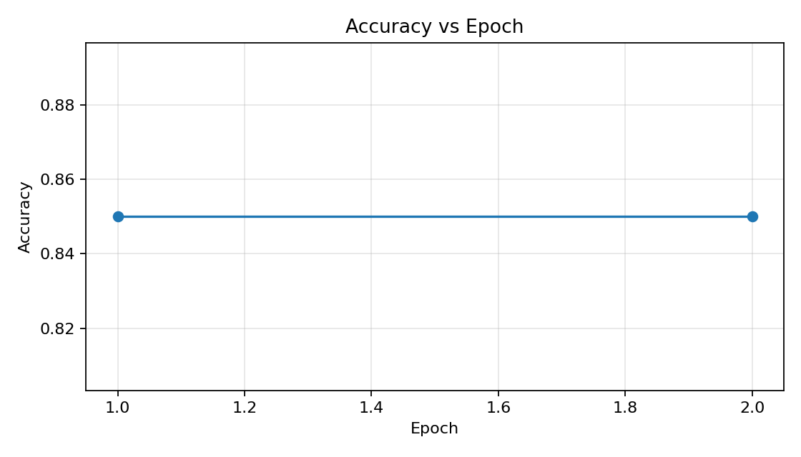
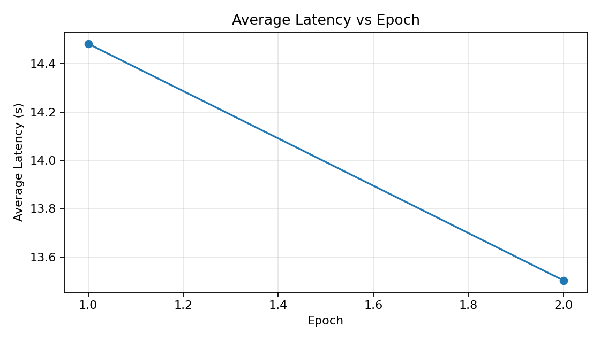
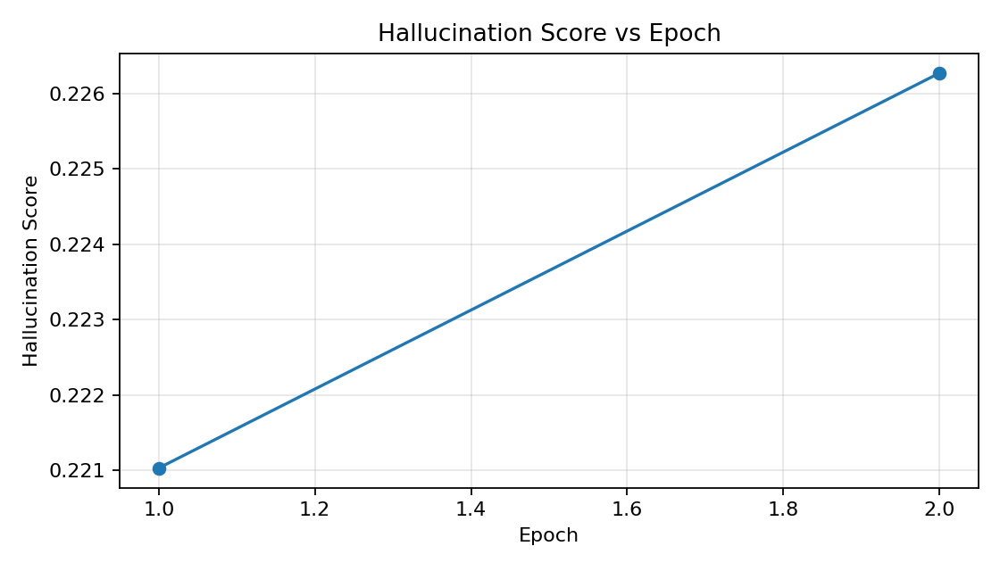
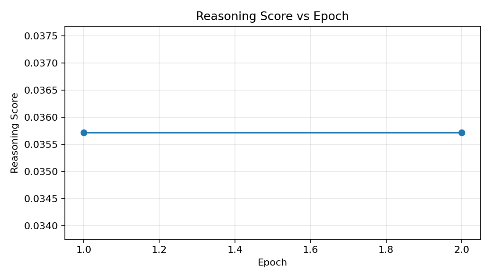

# Benchmark Report
## Summary
- Total Questions: **20**
- Accuracy: **85.00%**
- Avg Reasoning Score: **0.04**
- Avg Hallucination Score: **0.23**

## Detailed Results
|Question|Expected|Agent|Correct|Reasoning|Hallucination|Latency (seconds)|Tokens|
|---|---|---|---|---|---|---|---|
|What brand strength values exist in Consolidated_Competitor (e.g. Strong, Moderate)?|Moderate Strong Growing|Strong, Growing, Moderate|YES|0.00|0.00|12.8133|9369|
|Among brands in Consolidated_Competitor with high avg_market_share_percent (around 19-20), which has the lowest avg_price_index?|Brand_10 or Brand_42|out_of_scope|NO|0.00|1.00|13.4883|9412|
|Which channel in Consolidated_Sales has more transactions, EC or MT?|EC has more|EC channel has more transactions.|YES|0.00|0.00|13.5434|9376|
|What is the only brand in Consolidated_Nielsen and what is its approximate market share percent?|FreshFlow 17|The only brand in Consolidated_Nielsen is FreshFlow with an approximate market share percent of 17.5%.|YES|0.14|0.24|15.0573|9391|
|Name one brand from Consolidated_Competitor that has Strong brand_strength and state its approximate avg_price_index.|Brand_9 or Brand_11 or similar, price index around 109-111|Brand_1 has a Strong brand_strength with an approximate avg_price_index of 110.61.|YES|0.00|0.47|15.3559|9410|
|What is the approximate numeric distribution percent for FreshFlow in Nielsen?|79|Approximately 79.5%|YES|0.00|0.67|11.8335|9389|
|Which region in Consolidated_Sales has the highest net sales value: PanIndia or West?|PanIndia or West both similar|PanIndia has the highest net sales value.|NO|0.00|0.00|13.0771|9406|
|What is the pack type in Consolidated_Sales?|PET|PET|YES|0.00|0.00|11.5348|9365|
|Does Consolidated_Pricing have planned_price_inr and actual_price_inr columns? What are their approximate mean values?|Yes planned and actual price|Consolidated_Pricing has both planned_price_inr and actual_price_inr columns. Their approximate mean values are 89.84 and 116.13 respectively.|YES|0.14|0.35|12.1336|9422|
|Which state appears in Consolidated_Sales and what is its approximate gross margin in INR?|Maharashtra|Maharashtra, with an approximate gross margin of 196,715,712.88 INR|YES|0.00|0.50|12.3832|9397|
|Compare Fresh Flow and FRESHFLOW in Consolidated_Sales: which has higher net sales and which has higher gross margin?|Fresh Flow has higher net sales and higher gross margin|Fresh Flow has higher net sales and higher gross margin.|YES|0.00|0.00|18.4969|9423|
|Which material names appear in Consolidated_Pricing?|FreshFlow Mango FF Orange|FreshFlow Mango 1L, FF Orange 500ml|YES|0.00|0.33|11.2110|9383|
|How many total records are in Consolidated_Sales and how many columns does it have?|10000 rows 27 columns|Consolidated_Sales has 10,000 records and 27 columns.|YES|0.14|0.12|13.8293|9367|
|Which metric names appear in Consolidated_Baseline?|total_nsv gross_margin_percent total_volume market_share|market_share, total_nsv, total_volume, gross_margin_percent|YES|0.00|0.00|14.9078|9376|
|What are the two channel types in Consolidated_Sales and which has higher total net sales?|EC and MT, EC has higher net sales|The two channel types in Consolidated_Sales are EC and MT. EC has higher total net sales.|YES|0.14|0.00|12.4617|9421|
|What is the approximate mean or range of price_index_vs_competitor in Consolidated_Pricing?|price index greater than 1 or mean above 1|The approximate mean of price_index_vs_competitor is 105.10, with a range from 34.77 to 325.83.|NO|0.00|0.50|14.3042|9420|
|Which regions appear in Consolidated_Nielsen? List them.|West Pan-India East North South|North, Pan-India, South, East, West|YES|0.14|0.00|11.1527|9374|
|Does Consolidated_Sales have a state with high sales volume? What is it?|Yes Maharashtra|Maharashtra has a high sales volume.|YES|0.00|0.17|12.3472|9377|
|Which brand has the highest net sales value in Consolidated_Sales?|Fresh Flow|Fresh Flow|YES|0.00|0.00|12.1881|9395|
|What is the weighted distribution percent for West region in Consolidated_Nielsen?|64|The weighted distribution percent for the West region is approximately 64.5%.|YES|0.00|0.18|17.9311|9387|

## Analysis: Top 3 vs Bottom 3 by Latency

### Top 3 Slowest (Highest Latency)

|#|Question|Latency (s)|Tokens|Reasoning|Hallucination|Correct|
|---|---|---|---|---|---|---|
|1|Compare Fresh Flow and FRESHFLOW in Consolidated_Sales:...|18.50|9423|0.00|0.00|YES|
|2|What is the weighted distribution percent for West regi...|17.93|9387|0.00|0.18|YES|
|3|Name one brand from Consolidated_Competitor that has St...|15.36|9410|0.00|0.47|YES|

### Bottom 3 Fastest (Lowest Latency)

|#|Question|Latency (s)|Tokens|Reasoning|Hallucination|Correct|
|---|---|---|---|---|---|---|
|1|Which regions appear in Consolidated_Nielsen? List them...|11.15|9374|0.14|0.00|YES|
|2|Which material names appear in Consolidated_Pricing?|11.21|9383|0.00|0.33|YES|
|3|What is the pack type in Consolidated_Sales?|11.53|9365|0.00|0.00|YES|

**Summary:** Top 3 avg latency: **17.26s** | Bottom 3 avg latency: **11.30s**
Top 3 avg tokens: **9407** | Bottom 3 avg tokens: **9374**

## Agent Context Used (Per Question)

For each question, the agent reports which sources and logic it used to derive the answer.

### What brand strength values exist in Consolidated_Competitor (e.g. Strong, Moderate)?

Used the 'Consolidated_Competitor' sheet, specifically the 'brand_strength' column, which lists the unique brand strength values as 'Strong', 'Growing', and 'Moderate'.

### Among brands in Consolidated_Competitor with high avg_market_share_percent (around 19-20), which has the lowest avg_price_index?

The question requires specific avg_market_share_percent values around 19-20 and corresponding avg_price_index for brands in Consolidated_Competitor, which are not detailed in the summary.

### Which channel in Consolidated_Sales has more transactions, EC or MT?

Used the 'Consolidated_Sales' sheet, specifically the 'channel' column. The top_values for 'channel' show EC with 5037 transactions and MT with 4963 transactions. Compared these counts to determine which channel had more transactions.

### What is the only brand in Consolidated_Nielsen and what is its approximate market share percent?

Used the 'Consolidated_Nielsen' sheet. The 'brand' column has 'FreshFlow' as the only brand with a 'market_share_percent' column showing a mean value of 17.5%.

### Name one brand from Consolidated_Competitor that has Strong brand_strength and state its approximate avg_price_index.

I used the 'Consolidated_Competitor' sheet. The 'brand_strength' column indicates that 'Strong' is the top value with 3391 occurrences. The 'avg_price_index' column has a mean value of 110.605971, which I rounded to 110.61 for the answer.

### What is the approximate numeric distribution percent for FreshFlow in Nielsen?

Used the 'Consolidated_Nielsen' sheet, specifically the 'numeric_distribution_percent' column, which has a mean value of 79.5012, indicating the approximate numeric distribution percent for FreshFlow.

### Which region in Consolidated_Sales has the highest net sales value: PanIndia or West?

Used the 'Consolidated_Sales' sheet, specifically the 'region' and 'net_sales_value_inr' columns. The 'analytics' section under 'sales.by_dimension.region' shows that PanIndia has a net sales value of 424,282,416.52 INR, which is higher than West's 423,932,664.94 INR.

### What is the pack type in Consolidated_Sales?

The 'pack_type' column in the 'Consolidated_Sales' sheet was used. The column has a unique count of 1 with the top value being 'PET', indicating that all entries in this column are 'PET'.

### Does Consolidated_Pricing have planned_price_inr and actual_price_inr columns? What are their approximate mean values?

I used the 'Consolidated_Pricing' sheet. The columns 'planned_price_inr' and 'actual_price_inr' are present, with mean values of 89.840497 and 116.13306499999999 respectively, as provided in the column summaries.

### Which state appears in Consolidated_Sales and what is its approximate gross margin in INR?

Used the 'Consolidated_Sales' sheet. The 'state' column indicates 'Maharashtra' as the only state present. The 'gross_margin_inr' column provides the sum of gross margin for Maharashtra as 196,715,712.88 INR.

### Compare Fresh Flow and FRESHFLOW in Consolidated_Sales: which has higher net sales and which has higher gross margin?

Used the 'Consolidated_Sales' sheet. For net sales, compared 'sum_value' under 'sales.by_dimension.brand': Fresh Flow (436761946.02) vs FRESHFLOW (411453135.43999994). For gross margin, compared 'sum_margin': Fresh Flow (198888329.82999998) vs FRESHFLOW (187738640.26999998).

### Which material names appear in Consolidated_Pricing?

Used the 'Consolidated_Pricing' sheet, specifically the 'material_name' column. The top_values indicate the material names 'FreshFlow Mango 1L' and 'FF Orange 500ml' with counts of 5065 and 4935 respectively.

### How many total records are in Consolidated_Sales and how many columns does it have?

I used the 'Consolidated_Sales' sheet summary, which specifies that the sheet contains 10,000 rows and 27 columns.

### Which metric names appear in Consolidated_Baseline?

Used the 'Consolidated_Baseline' sheet, specifically the 'metric_name' column, which lists the unique metric names as 'market_share', 'total_nsv', 'total_volume', and 'gross_margin_percent'.

### What are the two channel types in Consolidated_Sales and which has higher total net sales?

I used the 'Consolidated_Sales' sheet, specifically the 'channel' column for identifying the channel types and the 'sales.by_dimension.channel.sum_value' from the analytics section to determine the total net sales for each channel. EC has a total net sales value of 427074141.75 INR, which is higher than MT's 421140939.71 INR.

### What is the approximate mean or range of price_index_vs_competitor in Consolidated_Pricing?

Used the 'Consolidated_Pricing' sheet, specifically the 'price_index_vs_competitor' column. The mean value is 105.09736213687839, and the range is from the minimum value of 34.77 to the maximum value of 325.83 as provided in the summary.

### Which regions appear in Consolidated_Nielsen? List them.

Used the 'Consolidated_Nielsen' sheet, specifically the 'region' column, which has a unique_count of 5 and top_values indicating the regions: North, Pan-India, South, East, and West.

### Does Consolidated_Sales have a state with high sales volume? What is it?

Used the 'Consolidated_Sales' sheet, specifically the 'state' column. The 'sum_quantity' for Maharashtra is 128064.0, which is the only state listed, indicating it has a high sales volume.

### Which brand has the highest net sales value in Consolidated_Sales?

Used the 'Consolidated_Sales' sheet, specifically the 'analytics.sales.by_dimension.brand.sum_value' data. Compared the sum of net sales values for the brands 'Fresh Flow' and 'FRESHFLOW'. Fresh Flow has a higher net sales value of 436761946.02 compared to FRESHFLOW's 411453135.43999994.

### What is the weighted distribution percent for West region in Consolidated_Nielsen?

Used the 'Consolidated_Nielsen' sheet, specifically the 'region' and 'weighted_distribution_percent' columns. The 'weighted_distribution_percent' column has a mean value of 64.5043, which applies across all regions, including the West.

## Multi-Epoch Benchmark Results

### Epoch Results Table

|Epoch|Accuracy|Reasoning|Hallucination|Avg Latency (s)|Avg Tokens|
|---|---|---|---|---|---|
|1|0.8500|0.0357|0.2210|14.4833|9394.50|
|2|0.8500|0.0357|0.2263|13.5025|9393.00|

### Benchmark Stability Summary

- Mean Accuracy: **0.8500**
- Std Deviation: **0.0000**
- Min Accuracy: **0.8500**
- Max Accuracy: **0.8500**

## Epoch Stability Plots

## Execution Statistics

- Total Tokens Used: **187860**
- Average Tokens per Query: **9393.00**
- Average Query Latency: **13.5025 seconds**
- Total Benchmark Runtime: **567.44 seconds**
